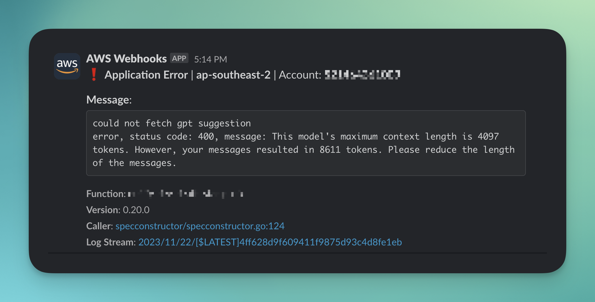

# CloudWatch Slack Alerts

<p align="center">

  <a href="https://opensource.org/licenses/MIT">
      
  </a>
  <a href="https://securityscorecards.dev/viewer/?uri=github.com/dstrates/cloudwatch-slack-alerts">
      
  </a>
</p>

This is a serverless solution that monitors for Lambda errors in AWS CloudWatch and sends alerts to a Slack channel.

The Lambda is triggered by a CloudWatch Log Susbcription Filter whenever a new log event is published. It analyzes log events to detect errors and relays this information to a designated Slack channel for notification.

## How it works

1. Alerter Lambda is triggered by a CloudWatch log group filter pattern
2. CloudWatch log is processed
3. Error message and log details are sent to Slack channel(s) via a [custom Slack app](https://api.slack.com/start/quickstart)



## Configuration

1. Add the following environment variables to your Lambda function:

- `SLACK_KEY_PARAMETER_NAME`: The name of the SSM parameter containing the Slack API key i.e. [Bot user OAuth token](https://api.slack.com/start/quickstart#getting-auth-token)
- `DEFAULT_SLACK_CHANNEL_PARAMETER_NAME`: The name of the SSM parameter containing the default Slack channel to route alerts
- `SLACK_CHANNEL_MAP_PARAMETER_NAME`: (Optional) The name of the SSM parameter containing the JSON channel map for alerts routing
- `ENABLE_SLACK_CHANNEL_MAP`: (Optional) This is a feature flag. Defaults to `false` which will route alerts to the `default_slack_channel_id`. Set `true` to send alerts for specific Lambda names to channels in the SSM parameter map of this form:

```json
{
  "channel1": "C057PQH2JBA",
  "channel2": "C057PQH2JBA",
  "channel3": "C057TEUPV7Y",
}
```

2. Create a CloudWatch Lambda subscription filter and subscribe the Alerter function with the following filter pattern.

See `cloudwatch.tf` for a complete Terraform implementation:

```hcl
      cloudwatch_lambda_errors_filter_pattern = <<EOT
    {
      ($.level = "error" || $.level = "ERROR") ||
      ($.message = "Task timed out") ||
      ($.message = "Error: Runtime exited") ||
      ($.message = "panic:") ||
      ($.message = "NetworkError") ||
      ($.message = "OutOfMemoryError") ||
      ($.message = "AccessDeniedException") ||
      ($.message = "ResourceNotFoundException") ||
      ($.message = "InvalidParameterException") ||
      ($.message = "InvalidRequestException") ||
    }
    EOT
```

3. `LogMessage` struct can be customised to fit your logging structure

## Terraform

- The `enable_cloudwatch_slack_alerts` variable controls the creation of the filter pattern resource
- The CloudWatch filter pattern needs to be created and associated with each Lambda function you want to monitor, an example method is provided in `./terraform/cloudwatch.tf`
